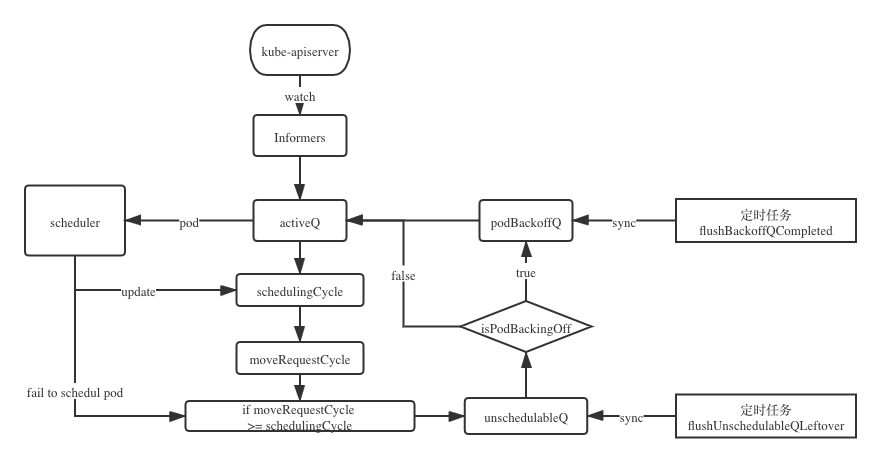

# kube-scheduler（1.19） 源码笔记

## SchedulingQueue三级调度队列



SchedulingQueue 是一个 Interface， 主要提供用以实现对 Pod 的入队出队操作，上图中 `PodBackoffMap` 已经被替换成`QueuedPodInfo`，`QueuedPodInfo`将贯穿于整个三个调度队列中。

```go
// QueuedPodInfo is a Pod wrapper with additional information related to
// the pod's status in the scheduling queue, such as the timestamp when
// it's added to the queue.
type QueuedPodInfo struct {
   Pod *v1.Pod
   // The time pod added to the scheduling queue.
  // 上次被调度的时间戳
   Timestamp time.Time
   // Number of schedule attempts before successfully scheduled.
   // It's used to record the # attempts metric.
  // 调度成功之前重试次数
   Attempts int
   // The time when the pod is added to the queue for the first time. The pod may be added
   // back to the queue multiple times before it's successfully scheduled.
   // It shouldn't be updated once initialized. It's used to record the e2e scheduling
   // latency for a pod.
  // pod第一次被调度的时间，在被初始化之后，该时间不会被更新，主要用于计算调度耗时
   InitialAttemptTimestamp time.Time
}
```


```go
// SchedulingQueue is an interface for a queue to store pods waiting to be scheduled.
// The interface follows a pattern similar to cache.FIFO and cache.Heap and
// makes it easy to use those data structures as a SchedulingQueue.
type SchedulingQueue interface {
   framework.PodNominator
   Add(pod *v1.Pod) error
   // AddUnschedulableIfNotPresent adds an unschedulable pod back to scheduling queue.
   // The podSchedulingCycle represents the current scheduling cycle number which can be
   // returned by calling SchedulingCycle().
   AddUnschedulableIfNotPresent(pod *framework.QueuedPodInfo, podSchedulingCycle int64) error
   // SchedulingCycle returns the current number of scheduling cycle which is
   // cached by scheduling queue. Normally, incrementing this number whenever
   // a pod is popped (e.g. called Pop()) is enough.
   SchedulingCycle() int64
   // Pop removes the head of the queue and returns it. It blocks if the
   // queue is empty and waits until a new item is added to the queue.
   Pop() (*framework.QueuedPodInfo, error)
   Update(oldPod, newPod *v1.Pod) error
   Delete(pod *v1.Pod) error
   MoveAllToActiveOrBackoffQueue(event string)
   AssignedPodAdded(pod *v1.Pod)
   AssignedPodUpdated(pod *v1.Pod)
   PendingPods() []*v1.Pod
   // Close closes the SchedulingQueue so that the goroutine which is
   // waiting to pop items can exit gracefully.
   Close()
   // NumUnschedulablePods returns the number of unschedulable pods exist in the SchedulingQueue.
   NumUnschedulablePods() int
   // Run starts the goroutines managing the queue.
   Run()
}
```

实际主要通过 `PriorityQueue` 来实现调度队列

```go
// PriorityQueue implements a scheduling queue.
// The head of PriorityQueue is the highest priority pending pod. This structure
// has three sub queues. One sub-queue holds pods that are being considered for
// scheduling. This is called activeQ and is a Heap. Another queue holds
// pods that are already tried and are determined to be unschedulable. The latter
// is called unschedulableQ. The third queue holds pods that are moved from
// unschedulable queues and will be moved to active queue when backoff are completed.
type PriorityQueue struct {
   // PodNominator abstracts the operations to maintain nominated Pods.
   framework.PodNominator

   stop  chan struct{}
   clock util.Clock

   // pod initial backoff duration.
   podInitialBackoffDuration time.Duration
   // pod maximum backoff duration.
   podMaxBackoffDuration time.Duration

   lock sync.RWMutex
   cond sync.Cond

   // activeQ is heap structure that scheduler actively looks at to find pods to
   // schedule. Head of heap is the highest priority pod.
   activeQ *heap.Heap
   // podBackoffQ is a heap ordered by backoff expiry. Pods which have completed backoff
   // are popped from this heap before the scheduler looks at activeQ
   podBackoffQ *heap.Heap
   // unschedulableQ holds pods that have been tried and determined unschedulable.
   unschedulableQ *UnschedulablePodsMap
   // schedulingCycle represents sequence number of scheduling cycle and is incremented
   // when a pod is popped.
   schedulingCycle int64
   // moveRequestCycle caches the sequence number of scheduling cycle when we
   // received a move request. Unscheduable pods in and before this scheduling
   // cycle will be put back to activeQueue if we were trying to schedule them
   // when we received move request.
   moveRequestCycle int64

   // closed indicates that the queue is closed.
   // It is mainly used to let Pop() exit its control loop while waiting for an item.
   closed bool
}
```

其中包含如下三级调度队列：

- activeQ，活动队列，主要用以存储当前所有正在等待调度的Pod
- unschedulableQ， 不可调度队列，当Pod申请的资源在当前集群中无法得到满足时，将会被调度至该队列中，当集群资源发生变化时，再次对该队列进行调度尝试
- podBackoffQ，失败队列，当pod调度失败之后将会增加到该队列，等待后续重试，反复调度失败的Pod将会按此增长等待时间，降低重试效率。

podBackoffQ 和 unschedulableQ，会定时从前面两个队列中拿出Pod放到activeQ队列。

- 每隔1秒执行 `flushBackoffQCompleted`，去找到backoffQ中等待到期的Pod，将其放入到activeQ中
- 每隔30秒执行 `flushUnschedulableQLeftover`，如果当前时间-pod的最后调度时间大于60s,就重新调度，转移到podBackoffQ或者activeQ中

### ActiveQ 

#### 资源发生变化时

当有新 Pod 被创建、或者集群资源发生变化时，比如 Node 资源信息发生变化，需要将原来 unschedulableQ 队列中调度失败的 Pod 进行重新调度，此处重新调度主要通过将 unschedulableQ 队列中 Pod 添加到 activeQ 或者 podBackoffQ 队列中，通过调用`MoveAllToActiveOrBackoffQueue(event string)` 方法实现。

```go
// MoveAllToActiveOrBackoffQueue moves all pods from unschedulableQ to activeQ or backoffQ.
// This function adds all pods and then signals the condition variable to ensure that
// if Pop() is waiting for an item, it receives it after all the pods are in the
// queue and the head is the highest priority pod.
func (p *PriorityQueue) MoveAllToActiveOrBackoffQueue(event string) {
   p.lock.Lock()
   defer p.lock.Unlock()
  // 创建与 unschedulableQ 中 Pod 数量相等的切片
   unschedulablePods := make([]*framework.QueuedPodInfo, 0, len(p.unschedulableQ.podInfoMap))
   for _, pInfo := range p.unschedulableQ.podInfoMap {
     // 将 unschedulableQ 队列中所有容器全部添加到上面创建的切片中
      unschedulablePods = append(unschedulablePods, pInfo)
   }
  // 将 unschedulableQ 中 Pod 按照不同类型添加 activeQ 或者 podBackoffQ 队列中
   p.movePodsToActiveOrBackoffQueue(unschedulablePods, event)
}

// NOTE: this function assumes lock has been acquired in caller
func (p *PriorityQueue) movePodsToActiveOrBackoffQueue(podInfoList []*framework.QueuedPodInfo, event string) {
   for _, pInfo := range podInfoList {
      pod := pInfo.Pod
     // 判断当前 Pod 仍然处于 podBackoff 重启阶段，则将该节点添加到 podBackoffQ 队列中
     // 主要通过获取当前 pod 重试次数 * podInitialBackoffDuration（默认1s）获取下次重试需要等待时间
     // 如果👆的等待时间 > podMaxBackoffDuration(默认10s)，则该 Pod 下次重试需要等待10s
     // 获取上次 Pod 调度时间 + 等待时间，如果前面的时间大于当前时间，则返回true。
      if p.isPodBackingoff(pInfo) {
        // 将还未完成重试的 Pod 继续添加到 podBackoffQ 队首，优先进行推送到 activeQ 队列中
         if err := p.podBackoffQ.Add(pInfo); err != nil {
            klog.Errorf("Error adding pod %v to the backoff queue: %v", pod.Name, err)
         } else {
            metrics.SchedulerQueueIncomingPods.WithLabelValues("backoff", event).Inc()
            p.unschedulableQ.delete(pod)
         }
      } else {
        // 如果该 Pod 已经到了重试的时间，则直接推送至 activeQ 队列中进行下一次调度
         if err := p.activeQ.Add(pInfo); err != nil {
            klog.Errorf("Error adding pod %v to the scheduling queue: %v", pod.Name, err)
         } else {
            metrics.SchedulerQueueIncomingPods.WithLabelValues("active", event).Inc()
            p.unschedulableQ.delete(pod)
         }
      }
   }
   // moveRequestCycle缓存schedulingCycle, 当未调度的pod重新被添加到activeQueue中
   // 会保存schedulingCycle到moveRequestCycle中
   p.moveRequestCycle = p.schedulingCycle
   p.cond.Broadcast()
}
```

ActiveQ加入操作干了啥呢？

- 会将Pod加入到activeQ，并且从backoffQ和 unschedulableQ中移除当前Pod
- 同时通过`sync.cond`广播通知阻塞在Pop操作的scheduler获取新的Pod

```go
// Add adds a pod to the active queue. It should be called only when a new pod
// is added so there is no chance the pod is already in active/unschedulable/backoff queues
func (p *PriorityQueue) Add(pod *v1.Pod) error {
   p.lock.Lock()
   defer p.lock.Unlock()
  // 新建 QueuedPodInfo 对象
   pInfo := p.newQueuedPodInfo(pod)
  // 将上述 Pod 添加到 activeQ
  // 如果 activeQ 中已经存在该 Pod 则更新，不存在则直接添加
   if err := p.activeQ.Add(pInfo); err != nil {
      klog.Errorf("Error adding pod %v to the scheduling queue: %v", nsNameForPod(pod), err)
      return err
   }
  // 从 unschedulableQ 中删除该 Pod 信息，防止二次调度
   if p.unschedulableQ.get(pod) != nil {
      klog.Errorf("Error: pod %v is already in the unschedulable queue.", nsNameForPod(pod))
      p.unschedulableQ.delete(pod)
   }
  // 从 podBackoffQ 中删除该 Pod 信息，防止二次调度
   // Delete pod from backoffQ if it is backing off
   if err := p.podBackoffQ.Delete(pInfo); err == nil {
      klog.Errorf("Error: pod %v is already in the podBackoff queue.", nsNameForPod(pod))
   }
   metrics.SchedulerQueueIncomingPods.WithLabelValues("active", PodAdd).Inc()
  // 存储 Pod 和被提名 Node，此处刚刚开始调度，所以 Node 名称是空
   p.PodNominator.AddNominatedPod(pod, "")
  // 广播通知所有携程，有新 pod 添加，准备对该 Pod 进行预选和优选过滤
   p.cond.Broadcast()

   return nil
}
```

如果调度失败之后，需要对调度失败 Pod 进行分流到其他两个队列中，但是应该放到 unschedulableQ 还是 podBackoffQ？

```go
// AddUnschedulableIfNotPresent inserts a pod that cannot be scheduled into
// the queue, unless it is already in the queue. Normally, PriorityQueue puts
// unschedulable pods in `unschedulableQ`. But if there has been a recent move
// request, then the pod is put in `podBackoffQ`.
func (p *PriorityQueue) AddUnschedulableIfNotPresent(pInfo *framework.QueuedPodInfo, podSchedulingCycle int64) error {
	p.lock.Lock()
	defer p.lock.Unlock()
	pod := pInfo.Pod
  // 如果 unschedulableQ 已经存在该 Pod，则返回
	if p.unschedulableQ.get(pod) != nil {
		return fmt.Errorf("pod: %v is already present in unschedulable queue", nsNameForPod(pod))
	}

	// Refresh the timestamp since the pod is re-added.
	pInfo.Timestamp = p.clock.Now()
  // 如果 activeQ 已经存在该 Pod，则返回
	if _, exists, _ := p.activeQ.Get(pInfo); exists {
		return fmt.Errorf("pod: %v is already present in the active queue", nsNameForPod(pod))
	}
  // // 如果 podBackoffQ 已经存在该 Pod，则返回
	if _, exists, _ := p.podBackoffQ.Get(pInfo); exists {
		return fmt.Errorf("pod %v is already present in the backoff queue", nsNameForPod(pod))
	}

	// If a move request has been received, move it to the BackoffQ, otherwise move
	// it to unschedulableQ.
  // 如果当前集群节点资源发生变化等情况出现，则将 Pod 移动到 podBackoffQ
	if p.moveRequestCycle >= podSchedulingCycle {
		if err := p.podBackoffQ.Add(pInfo); err != nil {
			return fmt.Errorf("error adding pod %v to the backoff queue: %v", pod.Name, err)
		}
		metrics.SchedulerQueueIncomingPods.WithLabelValues("backoff", ScheduleAttemptFailure).Inc()
	} else {
    // 否则移动到 unschedulableQ
		p.unschedulableQ.addOrUpdate(pInfo)
		metrics.SchedulerQueueIncomingPods.WithLabelValues("unschedulable", ScheduleAttemptFailure).Inc()
	}

  // 重置 NominatedPod 信息
	p.PodNominator.AddNominatedPod(pod, "")
	return nil
}
```

一般来说，当一个Pod不能够被调度的时候，它会被放到 unschedulableQ 中，但是如果收到了一个`Move Request`，那么就将这个Pod移到BackoffQ。这是因为最近集群资源发生了变更，如果放到 podBackoffQ，会更快的进行尝试这个Pod，更快地使它得到调度，主要是因为 podBackoffQ 会更快被更新到 activeQ 进行调度。

### PodBackoffQ

podBackoffQ主要存储那些在多个schedulingCycle中依旧调度失败的情况下，则会通过之前说的backOff机制，延迟等待调度的时间。同时也是一个堆，每次获取堆顶的元素，查看是否到期，如果到期则将其Pop出来，加入到activeQ中。

```go
// flushBackoffQCompleted Moves all pods from backoffQ which have completed backoff in to activeQ
func (p *PriorityQueue) flushBackoffQCompleted() {
   p.lock.Lock()
   defer p.lock.Unlock()
   for {
     // 获取当前 podBackoffQ 堆顶的 Pod
      rawPodInfo := p.podBackoffQ.Peek()
      if rawPodInfo == nil {
         return
      }
      pod := rawPodInfo.(*framework.QueuedPodInfo).Pod
     // 获取当前 Pod 的到期时间，如果未到期则返回
      boTime := p.getBackoffTime(rawPodInfo.(*framework.QueuedPodInfo))
      if boTime.After(p.clock.Now()) {
         return
      }
     // 如果时间到期则从 podBackoffQ 弹出该 Pod
      _, err := p.podBackoffQ.Pop()
      if err != nil {
         klog.Errorf("Unable to pop pod %v from backoff queue despite backoff completion.", nsNameForPod(pod))
         return
      }
     // 将该 Pod 添加到 activeQ 
      p.activeQ.Add(rawPodInfo)
      metrics.SchedulerQueueIncomingPods.WithLabelValues("active", BackoffComplete).Inc()
     // 通知各协程有新 Pod 加入
      defer p.cond.Broadcast()
   }
}
```

###UnschedulableQ

unschedulableQ 存储已经尝试调度但是当前集群资源不满足的pod的队列，如果当前时间-pod的最后调度时间大于60s，就重新调度，转移到podBackoffQ或者activeQ中。

```go
// flushUnschedulableQLeftover moves pod which stays in unschedulableQ longer than the unschedulableQTimeInterval
// to activeQ.
func (p *PriorityQueue) flushUnschedulableQLeftover() {
   p.lock.Lock()
   defer p.lock.Unlock()

   var podsToMove []*framework.QueuedPodInfo
   currentTime := p.clock.Now()
   for _, pInfo := range p.unschedulableQ.podInfoMap {
      lastScheduleTime := pInfo.Timestamp
     // 如果该 pod 1分钟内没有被调度就加入到 podsToMove
      if currentTime.Sub(lastScheduleTime) > unschedulableQTimeInterval {
         podsToMove = append(podsToMove, pInfo)
      }
   }

   if len(podsToMove) > 0 {
     // podsToMove将这些pod移动到activeQ
      p.movePodsToActiveOrBackoffQueue(podsToMove, UnschedulableTimeout)
   }
}
```
## SchedulerCache 核心源码实现

### schedulerCache 

为什么需要 Scheduler Cache ? 这里的Cache主要用来收集Pod和Node级别的信息，便于Generic Scheduler在调度时高效的查询。

```go
type schedulerCache struct {
	stop   <-chan struct{}
	ttl    time.Duration
	period time.Duration

	// This mutex guards all fields within this cache struct.
  // 读写锁确保读多写少场景下数据的安全
	mu sync.RWMutex
  
	// a set of assumed pod keys.
	// The key could further be used to get an entry in podStates.
  // 主要用来存储已经被调度器分配节点的pod
	assumedPods map[string]bool
  
	// a map from pod key to podState.
  // 存储pod对应的状态，状态主要包括 pod *v1.Pod、deadline *time.Time、bindingFinished bool
  // pod ，当前 pod 对应的配置信息
  // deadline ，用于记录 pod 过期时间，超过改时间点讲由cleanupAssumedPods删除
  // bindingFinished，标记当前pod是否被绑定中，如果false则说明还没完成绑定节点
	podStates map[string]*podState
  
  // 使用双向链表的形式存储节点的映射关系
  // 如果有节点信息发生更新，将会将节点信息放到链表表头
  // 越靠前的节点越是最新更新的节点
	nodes     map[string]*nodeInfoListItem
  
	// headNode points to the most recently updated NodeInfo in "nodes". It is the
	// head of the linked list.
  // headNode 指向当前👆 nodes 中最新更新的节点信息，即双向链表中最前面的节点
	headNode *nodeInfoListItem
  
  // nodeTree是一个树状数据结构，在每个区域中保存节点名称。 
  //目的是用于节点打散。节点打散主要是指的调度器调度的时候，在满足调度需求的情况下，为了保证pod均匀分配到所有的node节点上，通常会按照逐个zone逐个node节点进行分配，从而让pod节点打散在整个集群中。
	nodeTree *nodeTree
  
	// A map from image name to its imageState.
  // 用于存储镜像信息，包括镜像大小、存在该镜像的节点名称
	imageStates map[string]*imageState
}
```

###Pod状态

Cache的操作都是以Pod为中心的，对于每次Pod Events，Cache会做递增式update，下面是Cache的状态机。

```go
// State Machine of a pod's events in scheduler's cache
//   +-------------------------------------------+  +----+
//   |                            Add            |  |    |
//   |                                           |  |    | Update
//   +      Assume                Add            v  v    |
//Initial +--------> Assumed +------------+---> Added <--+
//   ^                +   +               |       +
//   |                |   |               |       |
//   |                |   |           Add |       | Remove
//   |                |   |               |       |
//   |                |   |               +       |
//   +----------------+   +-----------> Expired   +----> Deleted
//         Forget             Expire
```

这里有几个Event需要解释

- Assume：assumes a pod scheduled and aggregates the pod’s information into its node
- Forget：removes an assumed pod from cache
- Expire：After expiration, its information would be subtracted
- Add：either confirms a pod if it’s assumed, or adds it back if it’s expired
- Update：removes oldPod’s information and adds newPod’s information
- Remove：removes a pod. The pod’s information would be subtracted from assigned node.


