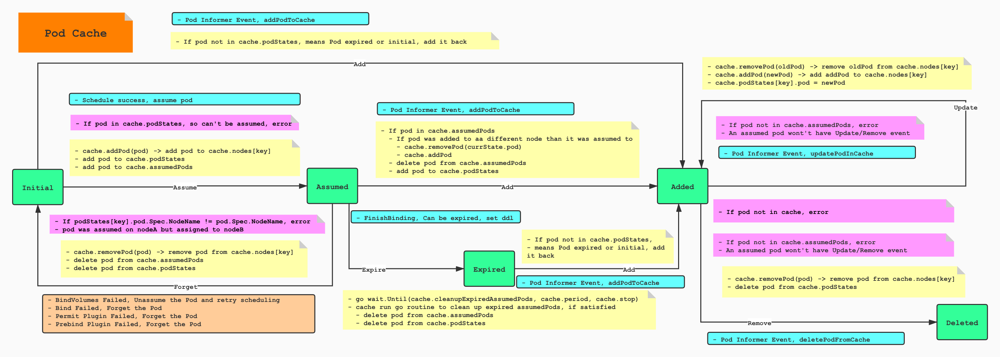
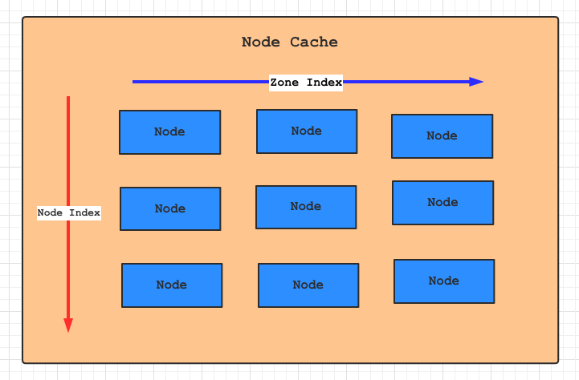

# kube-scheduler（1.19） 源码笔记

## SchedulingQueue三级调度队列


SchedulingQueue 是一个 Interface， 主要提供用以实现对 Pod 的入队出队操作，上图中 `PodBackoffMap` 已经被替换成`QueuedPodInfo`，`QueuedPodInfo`将贯穿于整个三个调度队列中。

```go
// QueuedPodInfo is a Pod wrapper with additional information related to
// the pod's status in the scheduling queue, such as the timestamp when
// it's added to the queue.
type QueuedPodInfo struct {
   Pod *v1.Pod
   // The time pod added to the scheduling queue.
  // 上次被调度的时间戳
   Timestamp time.Time
   // Number of schedule attempts before successfully scheduled.
   // It's used to record the # attempts metric.
  // 调度成功之前重试次数
   Attempts int
   // The time when the pod is added to the queue for the first time. The pod may be added
   // back to the queue multiple times before it's successfully scheduled.
   // It shouldn't be updated once initialized. It's used to record the e2e scheduling
   // latency for a pod.
  // pod第一次被调度的时间，在被初始化之后，该时间不会被更新，主要用于计算调度耗时
   InitialAttemptTimestamp time.Time
}
```


```go
// SchedulingQueue is an interface for a queue to store pods waiting to be scheduled.
// The interface follows a pattern similar to cache.FIFO and cache.Heap and
// makes it easy to use those data structures as a SchedulingQueue.
type SchedulingQueue interface {
   framework.PodNominator
   Add(pod *v1.Pod) error
   // AddUnschedulableIfNotPresent adds an unschedulable pod back to scheduling queue.
   // The podSchedulingCycle represents the current scheduling cycle number which can be
   // returned by calling SchedulingCycle().
   AddUnschedulableIfNotPresent(pod *framework.QueuedPodInfo, podSchedulingCycle int64) error
   // SchedulingCycle returns the current number of scheduling cycle which is
   // cached by scheduling queue. Normally, incrementing this number whenever
   // a pod is popped (e.g. called Pop()) is enough.
   SchedulingCycle() int64
   // Pop removes the head of the queue and returns it. It blocks if the
   // queue is empty and waits until a new item is added to the queue.
   Pop() (*framework.QueuedPodInfo, error)
   Update(oldPod, newPod *v1.Pod) error
   Delete(pod *v1.Pod) error
   MoveAllToActiveOrBackoffQueue(event string)
   AssignedPodAdded(pod *v1.Pod)
   AssignedPodUpdated(pod *v1.Pod)
   PendingPods() []*v1.Pod
   // Close closes the SchedulingQueue so that the goroutine which is
   // waiting to pop items can exit gracefully.
   Close()
   // NumUnschedulablePods returns the number of unschedulable pods exist in the SchedulingQueue.
   NumUnschedulablePods() int
   // Run starts the goroutines managing the queue.
   Run()
}
```

实际主要通过 `PriorityQueue` 来实现调度队列

```go
// PriorityQueue implements a scheduling queue.
// The head of PriorityQueue is the highest priority pending pod. This structure
// has three sub queues. One sub-queue holds pods that are being considered for
// scheduling. This is called activeQ and is a Heap. Another queue holds
// pods that are already tried and are determined to be unschedulable. The latter
// is called unschedulableQ. The third queue holds pods that are moved from
// unschedulable queues and will be moved to active queue when backoff are completed.
type PriorityQueue struct {
   // PodNominator abstracts the operations to maintain nominated Pods.
   framework.PodNominator

   stop  chan struct{}
   clock util.Clock

   // pod initial backoff duration.
   podInitialBackoffDuration time.Duration
   // pod maximum backoff duration.
   podMaxBackoffDuration time.Duration

   lock sync.RWMutex
   cond sync.Cond

   // activeQ is heap structure that scheduler actively looks at to find pods to
   // schedule. Head of heap is the highest priority pod.
   activeQ *heap.Heap
   // podBackoffQ is a heap ordered by backoff expiry. Pods which have completed backoff
   // are popped from this heap before the scheduler looks at activeQ
   podBackoffQ *heap.Heap
   // unschedulableQ holds pods that have been tried and determined unschedulable.
   unschedulableQ *UnschedulablePodsMap
   // schedulingCycle represents sequence number of scheduling cycle and is incremented
   // when a pod is popped.
   schedulingCycle int64
   // moveRequestCycle caches the sequence number of scheduling cycle when we
   // received a move request. Unscheduable pods in and before this scheduling
   // cycle will be put back to activeQueue if we were trying to schedule them
   // when we received move request.
   moveRequestCycle int64

   // closed indicates that the queue is closed.
   // It is mainly used to let Pop() exit its control loop while waiting for an item.
   closed bool
}
```

其中包含如下三级调度队列：

- activeQ，活动队列，主要用以存储当前所有正在等待调度的Pod
- unschedulableQ， 不可调度队列，当Pod申请的资源在当前集群中无法得到满足时，将会被调度至该队列中，当集群资源发生变化时，再次对该队列进行调度尝试
- podBackoffQ，失败队列，当pod调度失败之后将会增加到该队列，等待后续重试，反复调度失败的Pod将会按此增长等待时间，降低重试效率。

podBackoffQ 和 unschedulableQ，会定时从前面两个队列中拿出Pod放到activeQ队列。

- 每隔1秒执行 `flushBackoffQCompleted`，去找到backoffQ中等待到期的Pod，将其放入到activeQ中
- 每隔30秒执行 `flushUnschedulableQLeftover`，如果当前时间-pod的最后调度时间大于60s,就重新调度，转移到podBackoffQ或者activeQ中

### ActiveQ 

#### 资源发生变化时

当有新 Pod 被创建、或者集群资源发生变化时，比如 Node 资源信息发生变化，需要将原来 unschedulableQ 队列中调度失败的 Pod 进行重新调度，此处重新调度主要通过将 unschedulableQ 队列中 Pod 添加到 activeQ 或者 podBackoffQ 队列中，通过调用`MoveAllToActiveOrBackoffQueue(event string)` 方法实现。

```go
// MoveAllToActiveOrBackoffQueue moves all pods from unschedulableQ to activeQ or backoffQ.
// This function adds all pods and then signals the condition variable to ensure that
// if Pop() is waiting for an item, it receives it after all the pods are in the
// queue and the head is the highest priority pod.
func (p *PriorityQueue) MoveAllToActiveOrBackoffQueue(event string) {
   p.lock.Lock()
   defer p.lock.Unlock()
  // 创建与 unschedulableQ 中 Pod 数量相等的切片
   unschedulablePods := make([]*framework.QueuedPodInfo, 0, len(p.unschedulableQ.podInfoMap))
   for _, pInfo := range p.unschedulableQ.podInfoMap {
     // 将 unschedulableQ 队列中所有容器全部添加到上面创建的切片中
      unschedulablePods = append(unschedulablePods, pInfo)
   }
  // 将 unschedulableQ 中 Pod 按照不同类型添加 activeQ 或者 podBackoffQ 队列中
   p.movePodsToActiveOrBackoffQueue(unschedulablePods, event)
}

// NOTE: this function assumes lock has been acquired in caller
func (p *PriorityQueue) movePodsToActiveOrBackoffQueue(podInfoList []*framework.QueuedPodInfo, event string) {
   for _, pInfo := range podInfoList {
      pod := pInfo.Pod
     // 判断当前 Pod 仍然处于 podBackoff 重启阶段，则将该节点添加到 podBackoffQ 队列中
     // 主要通过获取当前 pod 重试次数 * podInitialBackoffDuration（默认1s）获取下次重试需要等待时间
     // 如果👆的等待时间 > podMaxBackoffDuration(默认10s)，则该 Pod 下次重试需要等待10s
     // 获取上次 Pod 调度时间 + 等待时间，如果前面的时间大于当前时间，则返回true。
      if p.isPodBackingoff(pInfo) {
        // 将还未完成重试的 Pod 继续添加到 podBackoffQ 队首，优先进行推送到 activeQ 队列中
         if err := p.podBackoffQ.Add(pInfo); err != nil {
            klog.Errorf("Error adding pod %v to the backoff queue: %v", pod.Name, err)
         } else {
            metrics.SchedulerQueueIncomingPods.WithLabelValues("backoff", event).Inc()
            p.unschedulableQ.delete(pod)
         }
      } else {
        // 如果该 Pod 已经到了重试的时间，则直接推送至 activeQ 队列中进行下一次调度
         if err := p.activeQ.Add(pInfo); err != nil {
            klog.Errorf("Error adding pod %v to the scheduling queue: %v", pod.Name, err)
         } else {
            metrics.SchedulerQueueIncomingPods.WithLabelValues("active", event).Inc()
            p.unschedulableQ.delete(pod)
         }
      }
   }
   // moveRequestCycle缓存schedulingCycle, 当未调度的pod重新被添加到activeQueue中
   // 会保存schedulingCycle到moveRequestCycle中
   p.moveRequestCycle = p.schedulingCycle
   p.cond.Broadcast()
}
```

ActiveQ加入操作干了啥呢？

- 会将Pod加入到activeQ，并且从backoffQ和 unschedulableQ中移除当前Pod
- 同时通过`sync.cond`广播通知阻塞在Pop操作的scheduler获取新的Pod

```go
// Add adds a pod to the active queue. It should be called only when a new pod
// is added so there is no chance the pod is already in active/unschedulable/backoff queues
func (p *PriorityQueue) Add(pod *v1.Pod) error {
   p.lock.Lock()
   defer p.lock.Unlock()
  // 新建 QueuedPodInfo 对象
   pInfo := p.newQueuedPodInfo(pod)
  // 将上述 Pod 添加到 activeQ
  // 如果 activeQ 中已经存在该 Pod 则更新，不存在则直接添加
   if err := p.activeQ.Add(pInfo); err != nil {
      klog.Errorf("Error adding pod %v to the scheduling queue: %v", nsNameForPod(pod), err)
      return err
   }
  // 从 unschedulableQ 中删除该 Pod 信息，防止二次调度
   if p.unschedulableQ.get(pod) != nil {
      klog.Errorf("Error: pod %v is already in the unschedulable queue.", nsNameForPod(pod))
      p.unschedulableQ.delete(pod)
   }
  // 从 podBackoffQ 中删除该 Pod 信息，防止二次调度
   // Delete pod from backoffQ if it is backing off
   if err := p.podBackoffQ.Delete(pInfo); err == nil {
      klog.Errorf("Error: pod %v is already in the podBackoff queue.", nsNameForPod(pod))
   }
   metrics.SchedulerQueueIncomingPods.WithLabelValues("active", PodAdd).Inc()
  // 存储 Pod 和被提名 Node，此处刚刚开始调度，所以 Node 名称是空
   p.PodNominator.AddNominatedPod(pod, "")
  // 广播通知所有携程，有新 pod 添加，准备对该 Pod 进行预选和优选过滤
   p.cond.Broadcast()

   return nil
}
```

如果调度失败之后，需要对调度失败 Pod 进行分流到其他两个队列中，但是应该放到 unschedulableQ 还是 podBackoffQ？

```go
// AddUnschedulableIfNotPresent inserts a pod that cannot be scheduled into
// the queue, unless it is already in the queue. Normally, PriorityQueue puts
// unschedulable pods in `unschedulableQ`. But if there has been a recent move
// request, then the pod is put in `podBackoffQ`.
func (p *PriorityQueue) AddUnschedulableIfNotPresent(pInfo *framework.QueuedPodInfo, podSchedulingCycle int64) error {
	p.lock.Lock()
	defer p.lock.Unlock()
	pod := pInfo.Pod
  // 如果 unschedulableQ 已经存在该 Pod，则返回
	if p.unschedulableQ.get(pod) != nil {
		return fmt.Errorf("pod: %v is already present in unschedulable queue", nsNameForPod(pod))
	}

	// Refresh the timestamp since the pod is re-added.
	pInfo.Timestamp = p.clock.Now()
  // 如果 activeQ 已经存在该 Pod，则返回
	if _, exists, _ := p.activeQ.Get(pInfo); exists {
		return fmt.Errorf("pod: %v is already present in the active queue", nsNameForPod(pod))
	}
  // // 如果 podBackoffQ 已经存在该 Pod，则返回
	if _, exists, _ := p.podBackoffQ.Get(pInfo); exists {
		return fmt.Errorf("pod %v is already present in the backoff queue", nsNameForPod(pod))
	}

	// If a move request has been received, move it to the BackoffQ, otherwise move
	// it to unschedulableQ.
  // 如果当前集群节点资源发生变化等情况出现，则将 Pod 移动到 podBackoffQ
	if p.moveRequestCycle >= podSchedulingCycle {
		if err := p.podBackoffQ.Add(pInfo); err != nil {
			return fmt.Errorf("error adding pod %v to the backoff queue: %v", pod.Name, err)
		}
		metrics.SchedulerQueueIncomingPods.WithLabelValues("backoff", ScheduleAttemptFailure).Inc()
	} else {
    // 否则移动到 unschedulableQ
		p.unschedulableQ.addOrUpdate(pInfo)
		metrics.SchedulerQueueIncomingPods.WithLabelValues("unschedulable", ScheduleAttemptFailure).Inc()
	}

  // 重置 NominatedPod 信息
	p.PodNominator.AddNominatedPod(pod, "")
	return nil
}
```

一般来说，当一个Pod不能够被调度的时候，它会被放到 unschedulableQ 中，但是如果收到了一个`Move Request`，那么就将这个Pod移到BackoffQ。这是因为最近集群资源发生了变更，如果放到 podBackoffQ，会更快的进行尝试这个Pod，更快地使它得到调度，主要是因为 podBackoffQ 会更快被更新到 activeQ 进行调度。

### PodBackoffQ

podBackoffQ主要存储那些在多个schedulingCycle中依旧调度失败的情况下，则会通过之前说的backOff机制，延迟等待调度的时间。同时也是一个堆，每次获取堆顶的元素，查看是否到期，如果到期则将其Pop出来，加入到activeQ中。

```go
// flushBackoffQCompleted Moves all pods from backoffQ which have completed backoff in to activeQ
func (p *PriorityQueue) flushBackoffQCompleted() {
   p.lock.Lock()
   defer p.lock.Unlock()
   for {
     // 获取当前 podBackoffQ 堆顶的 Pod
      rawPodInfo := p.podBackoffQ.Peek()
      if rawPodInfo == nil {
         return
      }
      pod := rawPodInfo.(*framework.QueuedPodInfo).Pod
     // 获取当前 Pod 的到期时间，如果未到期则返回
      boTime := p.getBackoffTime(rawPodInfo.(*framework.QueuedPodInfo))
      if boTime.After(p.clock.Now()) {
         return
      }
     // 如果时间到期则从 podBackoffQ 弹出该 Pod
      _, err := p.podBackoffQ.Pop()
      if err != nil {
         klog.Errorf("Unable to pop pod %v from backoff queue despite backoff completion.", nsNameForPod(pod))
         return
      }
     // 将该 Pod 添加到 activeQ 
      p.activeQ.Add(rawPodInfo)
      metrics.SchedulerQueueIncomingPods.WithLabelValues("active", BackoffComplete).Inc()
     // 通知各协程有新 Pod 加入
      defer p.cond.Broadcast()
   }
}
```

###UnschedulableQ

unschedulableQ 存储已经尝试调度但是当前集群资源不满足的pod的队列，如果当前时间-pod的最后调度时间大于60s，就重新调度，转移到podBackoffQ或者activeQ中。

```go
// flushUnschedulableQLeftover moves pod which stays in unschedulableQ longer than the unschedulableQTimeInterval
// to activeQ.
func (p *PriorityQueue) flushUnschedulableQLeftover() {
   p.lock.Lock()
   defer p.lock.Unlock()

   var podsToMove []*framework.QueuedPodInfo
   currentTime := p.clock.Now()
   for _, pInfo := range p.unschedulableQ.podInfoMap {
      lastScheduleTime := pInfo.Timestamp
     // 如果该 pod 1分钟内没有被调度就加入到 podsToMove
      if currentTime.Sub(lastScheduleTime) > unschedulableQTimeInterval {
         podsToMove = append(podsToMove, pInfo)
      }
   }

   if len(podsToMove) > 0 {
     // podsToMove将这些pod移动到activeQ
      p.movePodsToActiveOrBackoffQueue(podsToMove, UnschedulableTimeout)
   }
}
```
## SchedulerCache 核心源码实现

### schedulerCache 

为什么需要 Scheduler Cache ? 这里的Cache主要用来收集Pod和Node级别的信息，便于Generic Scheduler在调度时高效的查询。

```go
type schedulerCache struct {
	stop   <-chan struct{}
	ttl    time.Duration
	period time.Duration

	// This mutex guards all fields within this cache struct.
  // 读写锁确保读多写少场景下数据的安全
	mu sync.RWMutex
  
	// a set of assumed pod keys.
	// The key could further be used to get an entry in podStates.
  // 主要用来存储已经被调度器分配节点的pod
	assumedPods map[string]bool
  
	// a map from pod key to podState.
  // 存储pod对应的状态，状态主要包括 pod *v1.Pod、deadline *time.Time、bindingFinished bool
  // pod ，当前 pod 对应的配置信息
  // deadline ，用于记录 pod 过期时间，超过改时间点讲由cleanupAssumedPods删除
  // bindingFinished，标记当前pod是否被绑定中，如果false则说明还没完成绑定节点
	podStates map[string]*podState
  
  // 使用双向链表的形式存储节点的映射关系
  // 如果有节点信息发生更新，将会将节点信息放到链表表头
  // 越靠前的节点越是最新更新的节点
	nodes     map[string]*nodeInfoListItem
  
	// headNode points to the most recently updated NodeInfo in "nodes". It is the
	// head of the linked list.
  // headNode 指向当前👆 nodes 中最新更新的节点信息，即双向链表中最前面的节点
	headNode *nodeInfoListItem
  
  // nodeTree是一个树状数据结构，在每个区域中保存节点名称。 
  //目的是用于节点打散。节点打散主要是指的调度器调度的时候，在满足调度需求的情况下，为了保证pod均匀分配到所有的node节点上，通常会按照逐个zone逐个node节点进行分配，从而让pod节点打散在整个集群中。
	nodeTree *nodeTree
  
	// A map from image name to its imageState.
  // 用于存储镜像信息，包括镜像大小、存在该镜像的节点名称
	imageStates map[string]*imageState
}
```

###Pod状态

Cache的操作都是以Pod为中心的，对于每次Pod Events，Cache会做递增式update，下面是Cache的状态机。

```go
// State Machine of a pod's events in scheduler's cache
//   +-------------------------------------------+  +----+
//   |                            Add            |  |    |
//   |                                           |  |    | Update
//   +      Assume                Add            v  v    |
//Initial +--------> Assumed +------------+---> Added <--+
//   ^                +   +               |       +
//   |                |   |               |       |
//   |                |   |           Add |       | Remove
//   |                |   |               |       |
//   |                |   |               +       |
//   +----------------+   +-----------> Expired   +----> Deleted
//         Forget             Expire
```

Pod 事件：

- Assume：assumes a pod scheduled and aggregates the pod’s information into its node
- Forget：removes an assumed pod from cache
- Expire：After expiration, its information would be subtracted
- Add：either confirms a pod if it’s assumed, or adds it back if it’s expired
- Update：removes oldPod’s information and adds newPod’s information
- Remove：removes a pod. The pod’s information would be subtracted from assigned node.

与此同时还对应有Pod的几种状态，其中 Initial、Expired、Deleted这三种状态的Pod在Cache中实际上是不存在的，这里只是为了状态机的表示方便。
关于这几个状态的改变，有一个具体的实现结构体，主要是通过 podState 和 assumedPods 这两个map的状态来实现的。



Pod 状态:

- Initial：该状态为虚拟状态，默认情况下将没有调度的 Pod 都任务是处于该状态
- Assumed：当 Pod 调度成功且分配绑定节点之后，Pod 将会被加入到 assumedPod 队列中，该队列中 Pod 就处于 Assumed 状态
- Added：当有新 Pod Informer 事件触发，有三种情况 Pod 会进入 Added 状态:
  - 新建的 Pod 不存在于 cache.podStates 和 assumedPods 中。
  - 当前 Pod 处于 assumedPods 队列中，但是当前 Pod 真实分配 Node 和 assumedPods 中 Pod 分配的 Node 不一致，会被从 assumedPods 队列中移除，重新加入到 cache.podStates 队列。
  - 有可能之前 Pod 已经过期从 assumedPods 队列中移除，也会被重新加入到 cache.podStates 队列。

```go
// 该方法为 podInformer Added 事件的 Handler，即当有 Pod 被新建的时候，会执行该方法
func (cache *schedulerCache) AddPod(pod *v1.Pod) error {
   key, err := framework.GetPodKey(pod)
   if err != nil {
      return err
   }

   cache.mu.Lock()
   defer cache.mu.Unlock()

   currState, ok := cache.podStates[key]
   switch {
     // 如果该 Pod 同时存在于 cache.podStates 和 cache.assumedPods 两个队列中时
   case ok && cache.assumedPods[key]:
     // 判断实际 Pod 和 cache 中 Pod 的 Spec.NodeName 字段是否一致
      if currState.pod.Spec.NodeName != pod.Spec.NodeName {
         // The pod was added to a different node than it was assumed to.
         klog.Warningf("Pod %v was assumed to be on %v but got added to %v", key, pod.Spec.NodeName, currState.pod.Spec.NodeName)
         // Clean this up.
        // 如果 Spec.NodeName 字段不一致， 则需要从 cache.podStates 队列中删除该 Pod
         if err = cache.removePod(currState.pod); err != nil {
            klog.Errorf("removing pod error: %v", err)
         }
        // 重新添加该 Pod 到 cache.podStates 队列中
         cache.addPod(pod)
      }
     // 这里我们认定，Pod 不应该被 assume 两次，所以此处需要将该 Pod 从 assumedPods 中删除，进行重新调度
      delete(cache.assumedPods, key)
      cache.podStates[key].deadline = nil
      cache.podStates[key].pod = pod
   case !ok:
      // Pod was expired. We should add it back.
      cache.addPod(pod)
      ps := &podState{
         pod: pod,
      }
      cache.podStates[key] = ps
   default:
      return fmt.Errorf("pod %v was already in added state", key)
   }
   return nil
}
```

- Expired：finishBinding 之后，会按照 schedulerCache.ttl 设置 Pod 的 deadline 时间，scheduler 在启动时会启动一个 groutie 每 cleanAssumedPeriod = 1 * time.Second 时间执行一次 cleanupExpiredAssumedPods ，会从 assumedPods 和 cache.podStates 队列中清除过期的 Pod

```go
func (cache *schedulerCache) run() {
  // 启动协程每1秒执行清理过期 Pod 操作
   go wait.Until(cache.cleanupExpiredAssumedPods, cache.period, cache.stop)
}

func (cache *schedulerCache) cleanupExpiredAssumedPods() {
   cache.cleanupAssumedPods(time.Now())
}

// cleanupAssumedPods exists for making test deterministic by taking time as input argument.
// It also reports metrics on the cache size for nodes, pods, and assumed pods.
func (cache *schedulerCache) cleanupAssumedPods(now time.Time) {
   cache.mu.Lock()
   defer cache.mu.Unlock()
   defer cache.updateMetrics()

   // The size of assumedPods should be small
   for key := range cache.assumedPods {
     // 从 assumedPods 中读取 Pod
      ps, ok := cache.podStates[key]
      if !ok {
         klog.Fatal("Key found in assumed set but not in podStates. Potentially a logical error.")
      }
     // 判断是否完成绑定，如果没有完成绑定则退出清理
      if !ps.bindingFinished {
         klog.V(5).Infof("Couldn't expire cache for pod %v/%v. Binding is still in progress.",
            ps.pod.Namespace, ps.pod.Name)
         continue
      }
     // 如果 Pod 已经过期
      if now.After(*ps.deadline) {
         klog.Warningf("Pod %s/%s expired", ps.pod.Namespace, ps.pod.Name)
        // 执行过期操作
         if err := cache.expirePod(key, ps); err != nil {
            klog.Errorf("ExpirePod failed for %s: %v", key, err)
         }
      }
   }
}

func (cache *schedulerCache) expirePod(key string, ps *podState) error {
  // 从 NodeInfo 中删除该 Pod ，主要涉及清理 NodeInfo 中 podWithAffinity、podWithRequiredAntiAffinity、Pods 等数据结构
   if err := cache.removePod(ps.pod); err != nil {
      return err
   }
  // 从 assumedPods 中删除该 Pod
   delete(cache.assumedPods, key)
  // 从 podStates 中删除该 Pod
   delete(cache.podStates, key)
   return nil
}
```

在Cache的调度过程中，我们有以下几个假设:

- Pod是不会被Assume两次的
- 一个Pod可能会直接被Add而不经过scheduler，这种情况下，我们只会看见Add Event而不会看见Assume Event
- 如果一个Pod没有被Add过，那么他不会被Remove或者Update
- `Expired`和`Deleted`都是有效的最终状态。

### Node状态

在Cache中，Node通过双向链表的形式保存信息：

```go
// nodeInfoListItem holds a NodeInfo pointer and acts as an item in a doubly
// linked list. When a NodeInfo is updated, it goes to the head of the list.
// The items closer to the head are the most recently updated items.
type nodeInfoListItem struct {
   info *framework.NodeInfo
   next *nodeInfoListItem
   prev *nodeInfoListItem
}
```

其中，`NodeInfo`保存的信息如下所示，包含了和Node相关的一系列信息。

```go
// NodeInfo is node level aggregated information.
type NodeInfo struct {
   // Overall node information.
   node *v1.Node

   // Pods running on the node.
   Pods []*PodInfo

   // The subset of pods with affinity.
   PodsWithAffinity []*PodInfo

   // The subset of pods with required anti-affinity.
   PodsWithRequiredAntiAffinity []*PodInfo

   // Ports allocated on the node.
   UsedPorts HostPortInfo

   // Total requested resources of all pods on this node. This includes assumed
   // pods, which scheduler has sent for binding, but may not be scheduled yet.
   Requested *Resource
   // Total requested resources of all pods on this node with a minimum value
   // applied to each container's CPU and memory requests. This does not reflect
   // the actual resource requests for this node, but is used to avoid scheduling
   // many zero-request pods onto one node.
   NonZeroRequested *Resource
   // We store allocatedResources (which is Node.Status.Allocatable.*) explicitly
   // as int64, to avoid conversions and accessing map.
   Allocatable *Resource

   // ImageStates holds the entry of an image if and only if this image is on the node. The entry can be used for
   // checking an image's existence and advanced usage (e.g., image locality scheduling policy) based on the image
   // state information.
   ImageStates map[string]*ImageStateSummary

   // TransientInfo holds the information pertaining to a scheduling cycle. This will be destructed at the end of
   // scheduling cycle.
   // TODO: @ravig. Remove this once we have a clear approach for message passing across predicates and priorities.
   TransientInfo *TransientSchedulerInfo

   // Whenever NodeInfo changes, generation is bumped.
   // This is used to avoid cloning it if the object didn't change.
   Generation int64
}
```

在上面的 `schedulerCache` 中通过 `nodes` 这个 map 和 `headNode`这个指针可以很快的访问Node相关信息。

#### nodeInfo 更新

当收到informer通知，知道集群Node信息发生改变时，会更新Cache中的Node信息。

```go
Handler: cache.ResourceEventHandlerFuncs{
				AddFunc:    sched.addPodToCache,
				UpdateFunc: sched.updatePodInCache,
				DeleteFunc: sched.deletePodFromCache,
			},
```

这里的`add`、`update`、`delete`会分别调用Cache的 `AddNode`、`UpdateNode`和 `RemoveNode`等函数。以 `AddNode`为例：

```go
func (cache *schedulerCache) AddNode(node *v1.Node) error {
	cache.mu.Lock()
	defer cache.mu.Unlock()

	n, ok := cache.nodes[node.Name]
	if !ok {
		n = newNodeInfoListItem(framework.NewNodeInfo())
		cache.nodes[node.Name] = n
	} else {
		cache.removeNodeImageStates(n.info.Node())
	}
	cache.moveNodeInfoToHead(node.Name)

	cache.nodeTree.addNode(node)
	cache.addNodeImageStates(node, n.info)
	return n.info.SetNode(node)
}
```

- 根据需要可以创建新的 NodeInfo 结构体，并且插入到双向链表中。
- 每次更新Cache中的Node信息时，会将该Node移动到链表头。
- 同时会更新 `NodeTree` 和 `NodeImageStates`中的信息。

####nodeTree

在Cache中还有一个`NodeTree`的指针用一个树形结构体保存Node的相关信息，目的是用于节点打散。节点打散主要是指的调度器调度的时候，在满足调度需求的情况下，为了保证pod均匀分配到所有的node节点上，通常会按照逐个zone逐个node节点进行分配，从而让pod节点打散在整个集群中。

`NodeTree`的结构如下所示，NodeTree的tree是一个字典，key是zone的名字，value是一个nodeArray，通过这样可以把不同zone的Node分隔开。nodeArray负责存储一个zone下面的所有node节点，并且通过lastIndex记录当前zone分配的节点索引。

```go
type nodeTree struct {
	tree      map[string]*nodeArray // a map from zone (region-zone) to an array of nodes in the zone.
	zones     []string              // a list of all the zones in the tree (keys)
	zoneIndex int
	numNodes  int
}

type nodeArray struct {
	nodes     []string
	lastIndex int
}
```


